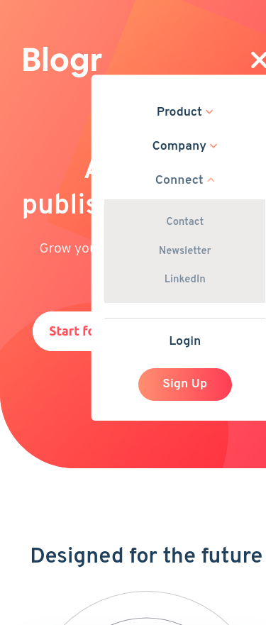

# Frontend Mentor - Blogr landing page solution

This is a solution to the [Blogr landing page challenge on Frontend Mentor](https://www.frontendmentor.io/challenges/blogr-landing-page-EX2RLAApP). Frontend Mentor challenges help you improve your coding skills by building realistic projects. 

## Table of contents

- [Frontend Mentor - Blogr landing page solution](#frontend-mentor---blogr-landing-page-solution)
  - [Table of contents](#table-of-contents)
  - [Overview](#overview)
    - [The challenge](#the-challenge)
    - [Screenshot](#screenshot)
    - [Links](#links)
  - [My process](#my-process)
    - [Built with](#built-with)
    - [What I learned](#what-i-learned)
    - [Continued development](#continued-development)
    - [Useful resources](#useful-resources)
  - [Author](#author)
  - [Acknowledgments](#acknowledgments)


## Overview

### The challenge

Users should be able to:

- View the optimal layout for the site depending on their device's screen size
- See hover states for all interactive elements on the page

### Screenshot



### Links

- Solution URL: [Add solution URL here](https://github.com/angelofdeity/blogr-landing-page-main/tree/dev)
- Live Site URL: [Add live site URL here](https://angelofdeity.github.io/blogr-landing-page-main/)

## My process

### Built with

- Semantic HTML5 markup
- CSS custom properties
- Flexbox
- CSS Grid
- Mobile-first workflow

### What I learned

I finally got to apply javascript to my webpage and really get a feel of dom manipulation. It was such a fun and engaging project😁

```js
// const proudOfThisJs = () => {
  const menuItems = ['Product', 'Company', 'Connect'];
for (const item of menuItems) {
  const arrow = document.querySelector(`#${item} .arrow`);
  const menuItem = document.getElementById(`${item}`);
  menuItem.onclick = () => {
    arrow.classList.toggle('rotate-down');
    console.log('Arrow flipped');
    menuItem.classList.toggle('clicked');
    const dropdown = document.querySelector(`#${item} .dropdown`);
    console.log(dropdown);
    if (dropdown) {
      dropdown.classList.toggle('visible');
    }
  };
}

// }
```

### Continued development

I would like to continue to learn more about javascript and how to use it to make my webpages more interactive.

### Useful resources

- [W3Schools](https://www.w3schools.com) - This helped me with the javascript code for the hamburger menu. I really liked this pattern and will use it going forward.

## Author

- Website - [Nico💙](https://lanico.tech)
- Frontend Mentor - [@Nico💙](https://www.frontendmentor.io/profile/angelofdeity)
- Twitter - [@Nico💙](https://www.twitter.com/angelofdeity)


## Acknowledgments

I would like to thank my mentor, [John Adibe](https://www.github.com/johnadibe123) for his guidance and support throughout this project.
He was also so kind as to help me review my work and give me feedback on how to improve it.😁

I would also like to thank [Frontend Mentor](https://www.frontendmentor.io) for providing such a great platform for learning and improving my skills as a web developer.
